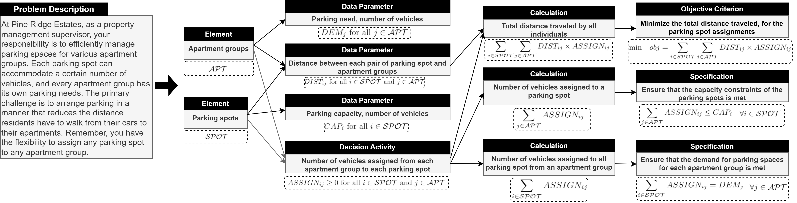
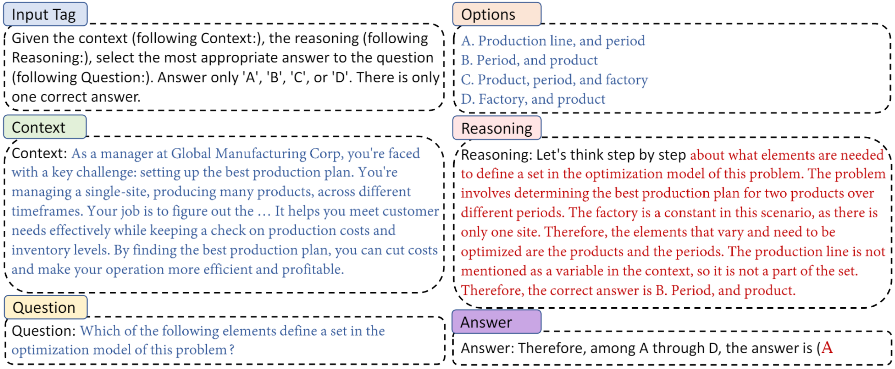

# Evaluating LLM Reasoning in the Operations Research Domain with ORQA


<h2 align="center"><strong>Accepted paper at AAAI 2025: <a href="https://arxiv.org/abs/2412.17874">arXiv Link</a></strong></h2>
  
Operations Research Question Answering (ORQA) is a new benchmark designed to assess the reasoning capabilities of Large Language Models (LLMs) in a specialized technical domain, namely Operations Research (OR). The benchmark evaluates whether LLMs can emulate the knowledge and reasoning skills of OR experts when presented with complex optimization problems. Crafted by OR experts, the dataset consists of real-world optimization problems that require multi-step mathematical reasoning to arrive at solutions. Our evaluations of several open-source LLMs, such as LLaMA 3.1, DeepSeek, and Mixtral, reveal their modest performance, highlighting a gap in their ability to generalize to specialized technical domains.


ORQA questions are hand-crafted to require complex, multi-step reasoning to identify the components of mathematical models and their interrelationships. An example of these components and their corresponding mathematical formulations is shown below.

<p align="center">
  
</p>

### For more detail about the dataset, code, evaluation and our results refer to [Huawei Cloud - ORQA](https://developer.huaweicloud.com/develop/aigallery/notebook/detail?id=6b98c56e-913b-47ef-8d9f-3266c8aec06a)


## Dataset Overview

The dataset can be found in the directory: `src/task/dataset`.

It includes two files:

- **Test Set (1468 instances)**: `ORQA_test.jsonl`
- **Validation Set (45 instances)**: `ORQA_validation.jsonl`

### Each Dataset Instance Contains:

1. **CONTEXT**: A description of an optimization problem presented as a case study in natural language.

2. **QUESTION**: A question related to the problem's specifications, underlying model components, or the logic of the optimization model. It might ask about:
   - Objective criteria or constraints
   - Model components (e.g., elements in the optimization)
   - Relationships between components

3. **OPTIONS**: A list of four possible answers. These are created by OR experts to make the question challenging. The LLM must choose the correct answer from these options.

4. **TARGET_ANSWER**: The correct answer to the question.

5. **REASONING**: For validation set only, which contains expert-created reasoning steps that explain how the correct answer is derived.

<p align="center">
  
</p>

### Example Instance (Validation Set)

Below is an example instance from the validation split, which includes expert-created reasoning steps used for in-context learning. **Note**: The test set instances do not contain these reasoning steps.

```json
instance = {
  "QUESTION_TYPE": "Q6", 
  "CONTEXT": "As a programming director at the Starlight Network, you're tasked with creating a lineup for the prime-time broadcasting...",
  "QUESTION": " What are the decision activities of the optimization problem?",
  "OPTIONS": ["Due date", "Show broadcast order", "Show broadcast indicator", "Processing time"], 
  "ARGET_ANSWER": 2, 
  "REASONING": "The possible decision activities mentioned in options ..."
}
```
---

## Download code with dataset ([link](https://vbdai-notebooks.obs.cn-north-4.myhuaweicloud.com/orqa/code.zip))

```bash
!wget https://vbdai-notebooks.obs.cn-north-4.myhuaweicloud.com/orqa/code.zip
!unzip -qo code.zip
```
Dataset can be found in /src/task/dataset/
